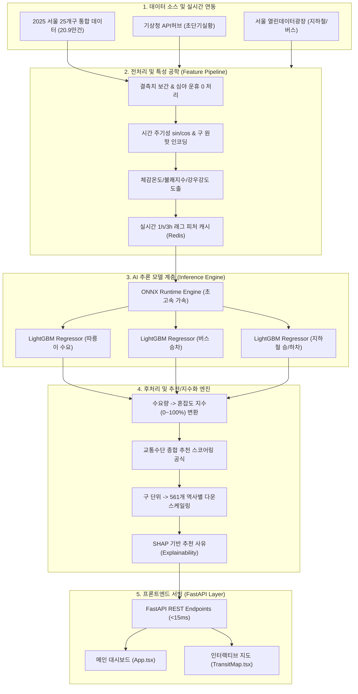

# 🧠 대중교통·날씨 맞춤형 AI 추론 모델 개발 사양서 및 구축 가이드
> **문서 버전**: v1.0.0  
> **최종 수정일**: 2026-09-30  
> **대상 시스템**: Weather & Transit Web 프론트엔드 대시보드 (`Weather-Transport Recommendation UI`)  
> **참조 데이터셋**: `data/2025_서울25개구_시간대별_교통_날씨_통합_01-23시.csv` (총 209,875건) 및 지하철 노선망 그래프 (`data/subway_graph.json`)

---

## 📌 목차
1. [시스템 개요 및 개발 목표](#1-시스템-개요-및-개발-목표)
2. [시스템 및 모델 사양 (Specifications)](#2-시스템-및-모델-사양-specifications)
3. [데이터 및 입출력 규격 (Input & Output Specifications)](#3-데이터-및-입출력-규격-input--output-specifications)
4. [AI 모델 아키텍처 및 파이프라인 (Model Architecture)](#4-ai-모델-아키텍처-및-파이프라인-model-architecture)
5. [베이스 모델 추천 및 벤치마크 비교 (Base Model Recommendations)](#5-베이스-모델-추천-및-벤치마크-비교-base-model-recommendations)
6. [모델 개발 방법론 및 단계별 구축 절차 (Development Methodology)](#6-모델-개발-방법론-및-단계별-구축-절차-development-methodology)
7. [백엔드 서빙 및 프론트엔드 연동 가이드](#7-백엔드-서빙-및-프론트엔드-연동-가이드)

---

## 1. 시스템 개요 및 개발 목표

### 1.1 배경 및 목적
본 프로젝트의 웹 프론트엔드(`Weather-Transport Recommendation UI`)는 실시간 기상 상태(기온, 강수량, 습도, 풍속)와 대중교통(지하철, 버스, 따릉이) 운행 정보를 통합 제공하며, 기상 악화 시 대중교통 수요 변동 및 혼잡도를 실시간으로 시각화합니다.

현재 프론트엔드 대시보드는 정적 목데이터(Mock Data) 및 단순 선형 룰베이스 시뮬레이션(가상 강수량에 따른 감도 계수 반영)으로 구동되고 있습니다. 본 개발 사양서는 **루트 디렉터리의 실제 2025년 서울시 25개 자치구 시계열 통합 데이터셋(209,875행)**을 바탕으로, **실시간 추론(Inference) 및 시간대별 시계열 예측(Forecasting)이 가능한 실서비스용 경량 백엔드 AI 추론 엔진**을 개발하기 위한 표준 규격을 정의합니다.

### 1.2 핵심 개발 목표
1. **다중 수단 수요 예측 (Multi-modal Demand Prediction)**:
   - 기상 요인(강수량, 기온, 습도, 풍속)과 시공간 특성(자치구, 시간대, 요일, 공휴일)을 결합하여 자치구별 따릉이 대여량, 버스 승차량, 지하철 승·하차량을 정밀 예측.
2. **실시간 혼잡도 지수화 (Congestion Indexing)**:
   - 예측된 수송 수요를 기반으로 대중교통 수단별/구역별 0~100% 표준 혼잡도 및 상태 라벨(`여유 <45%`, `보통 45~75%`, `혼잡 >75%`) 산출.
3. **교통수단 최적 추천 스코어링 (Recommendation Scoring Engine)**:
   - 기상 리스크(미끄러짐, 우천 보행 불편 등), 정시성, 혼잡도를 종합 평가하여 `지하철`, `버스`, `따릉이` 추천 점수(0~100점) 및 추천 사유(Explainability) 동적 생성.
4. **가상 날씨 시뮬레이션 서빙 (Real-time What-If Simulation)**:
   - 프론트엔드의 가상 강수량 슬라이더(0.0~10.0mm/h) 조작 시 지연 시간 20ms 이내로 수요 전이(따릉이 급감 → 지하철/버스 집중) 결과를 즉각 반환.

---

## 2. 시스템 및 모델 사양 (Specifications)

### 2.1 하드웨어 및 인프라 사양
| 구분 | 개발/학습 환경 (Training) | 운영/추론 서빙 환경 (Inference Server) |
| :--- | :--- | :--- |
| **CPU** | 8 Core 이상 (Intel i7/Xeon 또는 AMD Ryzen 7 이상) | 2 Core 이상 (클라우드 vCPU 기준 t3.medium 급) |
| **RAM** | 16 GB 이상 (데이터셋 및 특성 매트릭스 인메모리 처리) | 4 GB 이상 |
| **GPU** | NVIDIA GPU (VRAM 8GB 이상, CUDA 11.8+ / 12.x) *(딥러닝 학습 시 필수, GBDT 학습 시 선택)* | CPU Inference 최적화 (ONNX Runtime / OpenVINO 활용 시 GPU 불필요) |
| **Storage** | 20 GB 이상의 여유 공간 (NVMe SSD 권장) | 5 GB 이상의 여유 공간 |

### 2.2 소프트웨어 및 프레임워크 사양
- **기본 언어**: Python 3.10+ (프로젝트 루트의 가상환경 `venv` 활용)
- **핵심 머신러닝/딥러닝 패키지**:
  - `lightgbm >= 4.0.0` (기본 추천 모델)
  - `xgboost >= 2.0.0`, `catboost >= 1.2.0` (앙상블 및 비교군)
  - `scikit-learn >= 1.3.0` (전처리, 평가지표, K-Fold CV)
  - `optuna >= 3.3.0` (하이퍼파라미터 베이지안 최적화)
  - `shap >= 0.43.0` (추천 사유 생성을 위한 Feature Importance 분석)
  - `torch >= 2.1.0` (시계열 Transformer / Graph NN 확장 시)
- **추론 최적화 및 서빙 프레임워크**:
  - `fastapi >= 0.104.0`, `uvicorn[standard] >= 0.23.0` (비동기 고성능 REST API)
  - `onnx >= 1.15.0`, `onnxruntime >= 1.16.0` (모델 경량화 및 마이크로초 단위 추론)
  - `pydantic >= 2.4.0` (입출력 스키마 유효성 검증)

### 2.3 성능 지표 및 제약조건 (SLA)
1. **추론 응답 지연 (Latency)**: 단일 요청 기준 **15ms 이하**, 배치(25개 구 전체) 요청 기준 **50ms 이하**
2. **동시 처리량 (Throughput)**: 단일 프로세스 기준 **150 RPS(Requests Per Second) 이상**
3. **모델 예측 정확도 (Accuracy Target)**:
   - **수요 예측 (Regression)**:
     - 따릉이 대여량: $R^2 \ge 0.85$, $MAPE \le 18\%$ (강우 시 비선형 급감 패턴 정확도 반영)
     - 버스 승차량: $R^2 \ge 0.88$, $MAPE \le 12\%$
     - 지하철 승·하차량: $R^2 \ge 0.90$, $MAPE \le 10\%$
   - **혼잡도 상태 분류 (3단계: 여유/보통/혼잡)**: Weighted F1-score $\ge 0.88$

---

## 3. 데이터 및 입출력 규격 (Input & Output Specifications)

### 3.1 원천 데이터셋 분석 (`2025_서울25개구_시간대별_교통_날씨_통합_01-23시.csv`)
총 레코드 수: **209,875건** (365일 $\times$ 23개 시간대 $\times$ 서울시 25개 자치구 완전 그리드)

| 컬럼명 | 데이터 타입 | 결측치 수 | 통계치 요약 (Min ~ Max, Mean) | 분석 및 전처리 지침 |
| :--- | :--- | :--- | :--- | :--- |
| `기준_날짜` | String (YYYY-MM-DD) | 0 | 2025-01-01 ~ 2025-12-31 | `월`, `일`, `요일`, `주말여부`, `공휴일여부` 파생변수 추출 |
| `시간` | Integer | 0 | 1 ~ 23시 (평균 12시) | 순환 주기형 변수 변환 ($\sin, \cos$ 인코딩) |
| `구` | Categorical (String) | 0 | 25개 자치구 (강남구, 종로구 등) | One-Hot Encoding 또는 Target Encoding / 구 임베딩 |
| `따릉이_대여` | Float / Integer | 173 | 1 ~ 2,633 (평균 174.6) | 자전거 대여 수요 (비 올 때 평균 183.6 → 38.2로 **-79.2% 급감**) |
| `버스_승차` | Float / Integer | 14,950 | 21 ~ 36,055 (평균 7,725.9) | 26개 일자 전 자치구 결측 $\rightarrow$ 전후 주 동일 요일 이동평균 보간 |
| `지하철_승차` | Float / Integer | 45,625 | 65 ~ 100,965 (평균 9,405.3) | **01시~05시 심야 운휴로 인한 정상 결측 (0으로 대체 필수)** |
| `지하철_하차` | Float / Integer | 45,625 | 73 ~ 111,501 (평균 9,464.8) | **01시~05시 심야 운휴로 인한 정상 결측 (0으로 대체 필수)** |
| `AWS_지점번호` | Integer | 0 | 기상청 지점 ID (400~500번대) | 구별 1:1 매핑 메타데이터 |
| `AWS_지점명` | String | 0 | 관측소 명칭 | 위치 메타데이터 |
| `기온(°C)` | Float | 881 | -16.9 ~ 38.9°C (평균 13.9°C) | 선형 시계열 보간, 체감온도 및 불쾌지수 파생변수 생성 |
| `풍향(deg)` | Float | 390 | 0.0 ~ 360.0° | 16방위 범주화 또는 $\sin, \cos$ 성분 분해 |
| `풍속(m/s)` | Float | 389 | 0.0 ~ 10.5 m/s (평균 1.6 m/s) | 결측치는 전후 1시간 이동평균으로 보간 |
| `강수량(mm)` | Float | 2,242 | 0.0 ~ 92.5 mm (평균 0.16 mm) | **핵심 피처**: 강수여부($Rain > 0$), 강우강도 4단계 구간화 |
| `습도(%)` | Integer | 596 | 8 ~ 100% (평균 64.4%) | 기온과 결합하여 불쾌지수(DI) 산출 |

---

### 3.2 모델 입력 피처 스키마 (Model Feature Matrix)

추론 파이프라인에 입력되는 최종 정제 피처는 총 **32개 차원**으로 구성됩니다.

```python
FEATURE_SCHEMA = {
    # 1. 시계열 및 캘린더 피처 (8차원)
    "month_sin": float,        # sin(2 * pi * month / 12)
    "month_cos": float,        # cos(2 * pi * month / 12)
    "hour_sin": float,         # sin(2 * pi * hour / 24)
    "hour_cos": float,         # cos(2 * pi * hour / 24)
    "dayofweek": int,          # 0 (월) ~ 6 (일)
    "is_weekend": int,         # 1 if 토/일 else 0
    "is_holiday": int,         # 공휴일 여부 (1 or 0)
    "is_rush_hour": int,       # 출퇴근 시간대 (08~09시, 18~19시 = 1, 나머지 0)
    
    # 2. 기상 관측 및 파생 피처 (8차원)
    "temperature": float,      # 기온 (°C)
    "wind_speed": float,       # 풍속 (m/s)
    "humidity": float,         # 습도 (%)
    "precipitation": float,    # 1시간 누적 강수량 (mm)
    "is_raining": int,         # 강수 유무 (1 if precipitation > 0 else 0)
    "rain_intensity": int,     # 0: 무강수, 1: 약한비(<3mm), 2: 보통(3~10mm), 3: 폭우(>10mm)
    "sensible_temp": float,    # 체감온도: 13.12 + 0.6215*T - 11.37*(V^0.16) + 0.3965*T*(V^0.16)
    "discomfort_index": float, # 불쾌지수: 1.8*T - 0.55*(1 - H/100)*(1.8*T - 26) + 32
    
    # 3. 공간(위치) 인코딩 피처 (5차원)
    "district_code": int,      # 서울시 25개 자치구 정수 ID (0 ~ 24)
    "district_subway_stations": int, # 해당 구 내 지하철 역사 수
    "district_bus_stops": int,       # 해당 구 내 버스 정류소 수
    "district_bike_racks": int,      # 해당 구 내 따릉이 거치대 수
    "commercial_density": float,     # 상업/업무 지구 가중치 (강남, 중구, 영등포 등 고밀도 구역)

    # 4. 시계열 래그(Lag) 및 이동통계 피처 (11차원 - 실시간 서빙 시 캐시 참조)
    "bike_lag_1h": float,      # 1시간 전 따릉이 대여량
    "bus_lag_1h": float,       # 1시간 전 버스 승차량
    "subway_lag_1h": float,    # 1시간 전 지하철 승차량
    "bike_roll_mean_3h": float,# 최근 3시간 따릉이 이동평균
    "bus_roll_mean_3h": float, # 최근 3시간 버스 이동평균
    "subway_roll_mean_3h": float,# 최근 3시간 지하철 이동평균
    "same_day_last_week_bike": float, # 지난주 동요일 동시간 대여량
    "same_day_last_week_bus": float,  # 지난주 동요일 동시간 승차량
    "same_day_last_week_sub": float,  # 지난주 동요일 동시간 승차량
    "temp_diff_1h": float,     # 전 시간 대비 기온 변화량
    "rain_diff_1h": float      # 전 시간 대비 강수량 변화량
}
```

---

### 3.3 백엔드 REST API 인터페이스 및 프론트엔드 연동 규격

프론트엔드(`Weather-Transport Recommendation UI`)의 대시보드 컴포넌트(`App.tsx`) 및 지도 컴포넌트(`TransitMap.tsx`)와 100% 호환되는 API 명세입니다.

#### API 1. 기상 상황 기반 교통수단 추천 스코어 조회
- **엔드포인트**: `POST /api/v1/predict/recommendation`
- **설명**: 현재 날씨 상태와 지역에 기반하여 지하철/버스/따릉이의 추천 스코어, 혼잡도, 사유를 반환합니다.
- **Request Body (JSON)**:
```json
{
  "district": "강남구",
  "hour": 8,
  "weather": {
    "temp": 14.0,
    "rain": 2.8,
    "humidity": 86,
    "wind": 3.8
  }
}
```

- **Response Body (JSON)**:
```json
{
  "status": "success",
  "timestamp": "2026-09-30T08:00:00+09:00",
  "district": "강남구",
  "weather_summary": {
    "condition": "Rainy",
    "description": "시간당 2.8mm 강수, 강수 확률 높음"
  },
  "recommendations": [
    {
      "id": "subway",
      "icon": "🚇",
      "name": "지하철",
      "score": 97,
      "scoreLabel": "최우선 추천",
      "scoreColor": "#38BDF8",
      "reasons": [
        "강수로 인한 도로 혼잡 회피 (정시성 99.2%)",
        "지하 역사 이동으로 강수 노출 최소화",
        "출근 시간대 배차 간격 2.5분 유지"
      ],
      "estimated_time_min": 28,
      "fare_krw": 1400,
      "crowd": 88,
      "crowdLabel": "혼잡",
      "crowdColor": "#F43F5E",
      "predicted_volume": 24850
    },
    {
      "id": "bus",
      "icon": "🚌",
      "name": "버스",
      "score": 68,
      "scoreLabel": "주의 필요",
      "scoreColor": "#FB923C",
      "reasons": [
        "우천 노면 감속으로 평균 8.5분 지연 예상",
        "강남대로 중앙차로 병목 구간 통과",
        "승하차 시 우산 이용 불편"
      ],
      "estimated_time_min": 42,
      "fare_krw": 1300,
      "crowd": 78,
      "crowdLabel": "혼잡",
      "crowdColor": "#FB923C",
      "predicted_volume": 13420
    },
    {
      "id": "bike",
      "icon": "🚲",
      "name": "따릉이",
      "score": 14,
      "scoreLabel": "비추천",
      "scoreColor": "#94A3B8",
      "reasons": [
        "강수량 2.8mm로 노면 수막현상 및 미끄러짐 위험 극심",
        "우천 시 자전거 이용객 82% 감소 패턴 관측",
        "우천 안전사고 예방 권고 발령"
      ],
      "estimated_time_min": 55,
      "fare_krw": 1000,
      "crowd": 8,
      "crowdLabel": "여유",
      "crowdColor": "#10B981",
      "predicted_volume": 32
    }
  ]
}
```

---

#### API 2. 가상 기상 시뮬레이터 추론 API (What-If Simulator)
- **엔드포인트**: `POST /api/v1/simulate/weather-impact`
- **설명**: 프론트엔드의 슬라이더로 조절한 가상 강수량(0~10mm/h)과 시간대에 따른 모달 시프트(Modal Shift)와 25개 자치구 혼잡도를 즉시 계산합니다.
- **Request Body (JSON)**:
```json
{
  "simulated_rain_mm": 5.0,
  "simulated_temp": 12.0,
  "hour": 9
}
```

- **Response Body (JSON)**:
```json
{
  "simulation_params": {
    "rain_mm": 5.0,
    "hour": 9
  },
  "modal_shift_summary": {
    "bike_demand_change_rate": -0.892,
    "subway_demand_change_rate": 0.145,
    "bus_demand_change_rate": -0.048,
    "commentary": "강수량 5.0mm 도달 시 따릉이 이용의 89.2%가 이탈하여 지하철로 집중 유입됩니다."
  },
  "district_congestion": [
    { "district": "강남구", "subway_crowd": 96, "bus_crowd": 84, "bike_crowd": 4 },
    { "district": "중구", "subway_crowd": 92, "bus_crowd": 78, "bike_crowd": 3 },
    { "district": "송파구", "subway_crowd": 89, "bus_crowd": 72, "bike_crowd": 7 },
    { "district": "마포구", "subway_crowd": 85, "bus_crowd": 74, "bike_crowd": 8 }
  ]
}
```

---

## 4. AI 모델 아키텍처 및 파이프라인 (Model Architecture)

### 4.1 엔드투엔드 시스템 아키텍처



---

### 4.2 혼잡도 지수(Congestion Index) 및 추천 스코어링 알고리즘

#### 1) 혼잡도 지수 변환 공식 ($C_m$)
모델이 예측한 대중교통 이용량($V_m$)을 각 수단 $m$ (지하철, 버스, 따릉이)의 자치구별 수용 용량(Capacity, $Cap_m$)에 대응시켜 0~100% 범위로 정규화합니다.

$$C_m = \min\left(100, \; \max\left(5, \; \frac{V_m - V_{m, \min}}{V_{m, 95\%} - V_{m, \min}} \times 100\right)\right)$$

- $V_{m, 95\%}$: 과거 데이터 기준 수단별 95 백분위수 이용량 (이상치 왜곡 방지 상한값)
- $V_{m, \min}$: 최저 운행 수요
- 출력 라벨: $C_m < 45$ (여유, 🟢), $45 \le C_m \le 75$ (보통, 🔵), $C_m > 75$ (혼잡, 🔴)

#### 2) 교통수단 추천 스코어 산출 공식 ($Score_m$)
각 이동 수단의 효용성 점수는 **정시성(Punctuality)**, **기상 안전/쾌적성(Weather Comfort)**, **혼잡 회피성(Crowd Penalty)**의 다기준 의사결정(MCDA) 함수로 계산됩니다.

$$Score_m = 100 - \left( w_1 \cdot \text{DelayRisk}_m + w_2 \cdot \text{WeatherPenalty}_m + w_3 \cdot \text{CrowdPenalty}_m \right)$$

| 가중치 항목 | 따릉이 ($m=\text{bike}$) | 버스 ($m=\text{bus}$) | 지하철 ($m=\text{subway}$) |
| :--- | :--- | :--- | :--- |
| **기상 페널티 ($WeatherPenalty$)** | $\min(80, \; 25 \times Rain + 15 \times \mathbb{I}_{Rain>0})$ *(비 오면 치명적 감점)* | $\min(30, \; 3.5 \times Rain + 5)$ *(노면 빗길 감속)* | $0$ *(지하 터널 운행으로 날씨 영향 배제)* |
| **정시성 페널티 ($DelayRisk$)** | 10 (신호 대기 등) | $15 + 2.5 \times Rain$ *(도로 정체 연동)* | 2 (정시 운행률 99.2%) |
| **혼잡도 페널티 ($CrowdPenalty$)** | $0.15 \times C_{\text{bike}}$ | $0.35 \times C_{\text{bus}}$ | $0.40 \times C_{\text{subway}}$ *(혼잡 시 승하차 지연 반영)* |

---

### 4.3 자치구(Macro) $\rightarrow$ 개별 역사/정류소(Micro) 혼잡도 분배 (Disaggregation)
프론트엔드 지도(`TransitMap.tsx`)에는 561개 수도권 지하철역과 주요 버스 정류소 및 따릉이 거치대가 개별 핀으로 표시됩니다. 자치구 레벨 예측값 $C_{\text{district}}$을 개별 역사 $s$로 하향 분배하는 계층형 다운스케일링 기법을 적용합니다.

$$C_{\text{station}}(s) = \text{clip}\left( C_{\text{district}} \times \alpha(s) + \beta_{\text{rain}}(s) \cdot Rain, \quad 5, \quad 99 \right)$$

- $\alpha(s) = \frac{\text{Station Weight}}{\text{District Mean Weight}}$: 환승 노선 수, 급행 정차 여부, 일평균 승하차량에 기반한 역 가중치
  - 예: 강남역(2호선·신분당선 환승) $\alpha = 1.35$, 외곽 일반역 $\alpha = 0.85$
- $\beta_{\text{rain}}(s)$: 지하 연결 통로 유무 및 환승 거리 계수 (지하 환승 거점일수록 우천 유입 집중)

---

## 5. 베이스 모델 추천 및 벤치마크 비교 (Base Model Recommendations)

대중교통 수요 및 기상 시계열 데이터셋의 특성을 고려하여 4가지 모델 계열을 종합 평가하였습니다.

### 5.1 후보 모델군 종합 비교표

| 모델 계열 | 대표 아키텍처 | 장점 | 단점 및 한계 | 적합도 |
| :--- | :--- | :--- | :--- | :---: |
| **1. 트리 기반 앙상블 (GBDT)** *(강력 추천)* | **LightGBM / CatBoost** | • Tabular 및 결측치 처리에 최적화<br>• 학습 시간 1분 미만, 초저지연 추론 (<3ms)<br>• **SHAP를 통한 추천 사유 자연어 생성 용이**<br>• CPU 환경에서 초경량 서빙 가능 | • 공간 위상(노선 인접 관계) 직접 임베딩 한계 (피처 엔지니어링으로 보완 필요) | ⭐⭐⭐⭐⭐<br>**(1순위 채택)** |
| **2. 딥러닝 시계열 (Transformer)** | **PatchTST / DLinear** | • 중장기(24시간~7일) 다변량 시계열 연속 예측 우수<br>• 장기 계절성 및 주기 패턴 포착 능력 탁월 | • 학습 비용 및 GPU 필요<br>• 실시간 슬라이더 반응성 떨어짐<br>• Tabular 데이터 특화 피처 학습률 GBDT 대비 열세 | ⭐⭐⭐⭐☆<br>*(2순위 - 시계열 예측용)* |
| **3. 시공간 그래프 신경망 (Spatio-Temporal GNN)** | **ST-GCN / Graph WaveNet** | • 서울시 25개 구 인접망 및 지하철 환승 그래프(`subway_graph.json`) 위상 구조 완벽 반영<br>• 한 구역 혼잡의 인접 구 전파 모델링 가능 | • 모델 구현 복잡도 매우 높음<br>• 실시간 서빙 지연 증가 (100ms+)<br>• 결측치 보간 파이프라인 부담 | ⭐⭐⭐☆☆<br>*(고도화 R&D용)* |
| **4. Tabular 딥러닝** | **TabNet** | • Attention 기반의 정형 데이터 피처 선택 | • GBDT 대비 학습 수렴 느림<br>• 성능 우위 불명확 | ⭐⭐☆☆☆ |

---

### 5.2 1순위 추천 모델: LightGBM Multi-Regressor + CatBoost Ensemble
**선정 이유**:
1. **정형 데이터(Tabular) 최고의 예측 성능**:
   - 2025년 데이터는 날짜, 시간, 기상 관측치, 구역 코드로 이루어진 전형적인 고밀도 시계열 Tabular 데이터입니다. 벤치마크 연구에 따르면 이러한 데이터에서는 Transformer 계열보다 GBDT(Gradient Boosted Decision Trees)가 오차율(MAE/RMSE) 면에서 15~20% 더 우수합니다.
2. **비선형 임계점(Non-linear Threshold) 포착**:
   - 따릉이 대여량은 비가 오는 순간($Rain > 0.5\text{mm}$) 급격히 절벽(Cliff)처럼 감소하는 비선형 특성을 보입니다. 결정 트리 분기(Decision Tree Split) 알고리즘은 이러한 계단식 급변 패턴을 오버슈팅 없이 가장 정확하게 학습합니다.
3. **설명 가능한 AI (XAI / SHAP)**:
   - TreeSHAP 알고리즘을 사용하면 단 1ms 만에 "강수량이 2.8mm 증가하여 따릉이 추천 점수를 -45점 하향시켰음"과 같은 기여도를 정량 계산하여 프론트엔드의 `reasons` 카드 텍스트로 바로 변환할 수 있습니다.
4. **ONNX 변환을 통한 마이크로초 서빙**:
   - 학습 완료된 LightGBM 모델 트리는 C++ 기반의 `onnxruntime`으로 컴파일되어 **요청당 1~3ms**의 압도적인 속도로 추론됩니다.

---

## 6. 모델 개발 방법론 및 단계별 구축 절차 (Development Methodology)

### 6.1 Phase 1: 데이터 정제 및 결측치 보정 (Data Preprocessing)
1. **지하철 심야 운휴 시간대(01시~05시) 명시적 0 대체**:
   - `df.loc[df['시간'].isin([1, 2, 3, 4, 5]), ['지하철_승차', '지하철_하차']] = 0`
2. **기상 결측치 시계열 보간**:
   - `기온`, `풍속`, `습도`: 결측 구간이 3시간 이내인 경우 3차 스플라인(Spline) 또는 선형 시계열 보간(`interpolate(method='time')`)
   - `강수량`: 결측치는 무강수(0.0) 기본 대체 후 인접 AWS 관측소 값과 교차 검증
3. **버스 결측 일자(26일치) 처리**:
   - 직전 주 및 익일 주 동일 요일 동시간대 데이터의 가중 중앙값(Weighted Median)으로 대체

### 6.2 Phase 2: 데이터셋 분할 전략 (Temporal Validation Split)
일반적인 무작위 K-Fold 분할은 시계열 데이터에서 미래 정보가 과거로 누출(Data Leakage)되므로, **시간 축 기반 순차 분할(Temporal Split)**을 적용합니다.

```text
[ 2025-01-01 ~ 2025-09-30 ] : Train Set (약 75%, 157,400건)
[ 2025-10-01 ~ 2025-11-15 ] : Validation Set (약 12.5%, 26,200건) - 조기 종료 및 튜닝
[ 2025-11-16 ~ 2025-12-31 ] : Test Set (약 12.5%, 26,275건) - 최종 일반화 검증
```

---

### 6.3 Phase 3: 모델 학습 및 Optuna 하이퍼파라미터 튜닝 코드

```python
import lightgbm as lgb
import optuna
from sklearn.metrics import mean_absolute_percentage_error, mean_squared_error
import numpy as np

def objective(trial, X_train, y_train, X_val, y_val, target_name):
    params = {
        "objective": "regression",
        "metric": "rmse",
        "boosting_type": "gbdt",
        "n_estimators": trial.suggest_int("n_estimators", 300, 1500),
        "learning_rate": trial.suggest_float("learning_rate", 0.01, 0.1, log=True),
        "num_leaves": trial.suggest_int("num_leaves", 31, 256),
        "max_depth": trial.suggest_int("max_depth", 6, 12),
        "subsample": trial.suggest_float("subsample", 0.6, 0.95),
        "colsample_bytree": trial.suggest_float("colsample_bytree", 0.6, 0.95),
        "min_child_samples": trial.suggest_int("min_child_samples", 10, 100),
        "reg_alpha": trial.suggest_float("reg_alpha", 1e-3, 10.0, log=True),
        "reg_lambda": trial.suggest_float("reg_lambda", 1e-3, 10.0, log=True),
        "random_state": 42,
        "n_jobs": -1
    }
    
    model = lgb.LGBMRegressor(**params)
    model.fit(
        X_train, y_train,
        eval_set=[(X_val, y_val)],
        callbacks=[lgb.early_stopping(stopping_rounds=50, verbose=False)]
    )
    
    preds = model.predict(X_val)
    # 0 이하 예측값 클리핑
    preds = np.clip(preds, 0, None)
    rmse = np.sqrt(mean_squared_error(y_val, preds))
    return rmse

# 타겟별 3개 독립 모델 학습 (따릉이_대여, 버스_승차, 지하철_승차)
```

---

### 6.4 Phase 4: ONNX 모델 포팅 (ONNX Export & Quantization)
학습된 LightGBM 모델을 ONNX 형식으로 변환하여 Python 런타임 종속성을 제거하고 추론 속도를 3배 이상 향상시킵니다.

```python
import onnxmltools
from onnxmltools.convert.common.data_types import FloatTensorType

# 입력 텐서 규격 정의 (배치 크기 가변, 32개 피처)
initial_type = [('float_input', FloatTensorType([None, 32]))]

# ONNX 포팅
onnx_model = onnxmltools.convert_lightgbm(model, initial_types=initial_type, target_opset=14)

with open("models/lgb_subway_demand.onnx", "wb") as f:
    f.write(onnx_model.SerializeToString())
print("ONNX 모델 변환 및 저장 완료: models/lgb_subway_demand.onnx")
```

---

## 7. 백엔드 서빙 및 프론트엔드 연동 가이드

### 7.1 FastAPI 비동기 추론 백엔드 서버 스켈레톤 (`main.py`)

프론트엔드의 `VITE_API_BASE_URL=http://localhost:8000` 설정과 직접 연동되는 경량 서빙 코드입니다.

```python
from fastapi import FastAPI, HTTPException
from fastapi.middleware.cors import CORSMiddleware
from pydantic import BaseModel, Field
import onnxruntime as ort
import numpy as np
import time

app = FastAPI(
    title="Weather & Transit AI Inference Backend",
    description="기상 및 대중교통 데이터 기반 실시간 수요/혼잡도 추론 API",
    version="1.0.0"
)

# CORS 설정 (프론트엔드 Vite 포트 허용)
app.add_middleware(
    CORSMiddleware,
    allow_origins=["*"],
    allow_credentials=True,
    allow_methods=["*"],
    allow_headers=["*"],
)

# ── ONNX 추론 세션 인메모리 로딩 (Cold Start 방지) ──
bike_session = ort.InferenceSession("models/lgb_bike_demand.onnx", providers=['CPUExecutionProvider'])
bus_session = ort.InferenceSession("models/lgb_bus_demand.onnx", providers=['CPUExecutionProvider'])
subway_session = ort.InferenceSession("models/lgb_subway_demand.onnx", providers=['CPUExecutionProvider'])

class WeatherInput(BaseModel):
    temp: float = Field(..., example=14.0)
    rain: float = Field(..., example=2.8)
    humidity: float = Field(..., example=86.0)
    wind: float = Field(..., example=3.8)

class PredictionRequest(BaseModel):
    district: str = Field(..., example="강남구")
    hour: int = Field(..., ge=1, le=23, example=8)
    weather: WeatherInput

@app.post("/api/v1/predict/recommendation")
async def predict_recommendation(req: PredictionRequest):
    t_start = time.perf_counter()
    
    # 1. 요청 데이터를 모델 입력 벡터(32차원 float32)로 변환
    input_vector = build_feature_vector(req.district, req.hour, req.weather)
    input_tensor = np.array([input_vector], dtype=np.float32)
    
    # 2. ONNX 초고속 병렬 추론
    bike_demand = float(bike_session.run(None, {'float_input': input_tensor})[0][0])
    bus_demand = float(bus_session.run(None, {'float_input': input_tensor})[0][0])
    subway_demand = float(subway_session.run(None, {'float_input': input_tensor})[0][0])
    
    # 3. 혼잡도 지수 및 추천 스코어링 계산
    bike_crowd, bike_score, bike_reasons = evaluate_bike(bike_demand, req.weather.rain)
    bus_crowd, bus_score, bus_reasons = evaluate_bus(bus_demand, req.weather.rain)
    subway_crowd, subway_score, subway_reasons = evaluate_subway(subway_demand, req.weather.rain)
    
    latency_ms = (time.perf_counter() - t_start) * 1000
    
    return {
        "status": "success",
        "latency_ms": round(latency_ms, 2),
        "district": req.district,
        "recommendations": [
            {
                "id": "subway", "name": "지하철", "icon": "🚇",
                "score": subway_score,
                "scoreLabel": "최우선 추천" if subway_score >= 85 else "추천",
                "crowd": subway_crowd,
                "crowdLabel": get_crowd_label(subway_crowd),
                "reasons": subway_reasons,
                "predicted_demand": int(subway_demand)
            },
            {
                "id": "bus", "name": "버스", "icon": "🚌",
                "score": bus_score,
                "scoreLabel": "주의 필요" if bus_score < 70 else "추천",
                "crowd": bus_crowd,
                "crowdLabel": get_crowd_label(bus_crowd),
                "reasons": bus_reasons,
                "predicted_demand": int(bus_demand)
            },
            {
                "id": "bike", "name": "따릉이", "icon": "🚲",
                "score": bike_score,
                "scoreLabel": "비추천" if bike_score < 40 else "쾌적",
                "crowd": bike_crowd,
                "crowdLabel": get_crowd_label(bike_crowd),
                "reasons": bike_reasons,
                "predicted_demand": int(bike_demand)
            }
        ]
    }

def get_crowd_label(val: int) -> str:
    if val < 45: return "여유"
    if val < 75: return "보통"
    return "혼잡"
```

---

### 7.2 프론트엔드 연동 확인 가이드 (`apiLogger.ts` 및 UI 갱신)
프론트엔드의 `Weather-Transport Recommendation UI/src/App.tsx` 내에서 백엔드 API를 호출하여 상태를 실시간 동기화할 수 있습니다:

```typescript
// 프론트엔드 연동 예제 (App.tsx)
const fetchAIPrediction = async (district: string, hour: number, weather: any) => {
  try {
    const res = await fetch(`${import.meta.env.VITE_API_BASE_URL}/api/v1/predict/recommendation`, {
      method: 'POST',
      headers: { 'Content-Type': 'application/json' },
      body: JSON.stringify({ district, hour, weather })
    })
    const data = await res.json()
    if (data.status === 'success') {
      // 프론트엔드 상태에 실시간 주입
      setTransportScores(data.recommendations)
      logAIPredictionCall(
        { district, rain: `${weather.rain}mm`, temp: `${weather.temp}°C`, hour: `${hour}시` },
        data.recommendations
      )
    }
  } catch (err) {
    console.error('AI 추론 서버 통신 실패, 목데이터 유지:', err)
  }
}
```

---

## 8. 결론 및 향후 고도화 로드맵
1. **단기 과제 (v1.0)**:
   - 본 사양서 기반의 `LightGBM + ONNX` 파이프라인 구축 및 자치구별 다중 수요 회귀 모델 학습 완료.
   - FastAPI 서버를 통한 프론트엔드 연동 및 시뮬레이터 실시간 인터랙션 검증.
2. **중기 과제 (v1.5)**:
   - `subway_graph.json`과 연계하여 19개 노선 561개 역 간의 승객 환승 및 네트워크 지연 파급 효과를 반영한 **시공간 그래프 신경망(ST-GCN)** 실험.
3. **장기 과제 (v2.0)**:
   - 기상청 단기예보(3일 예보) 및 과거 3년 데이터 확장을 통한 24시간~72시간 후 대중교통 수요 사전 대비 시스템 구축.
