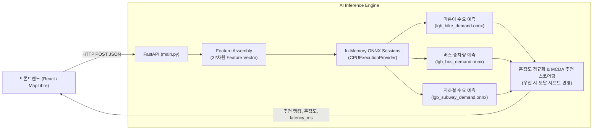

# ⚡ 대중교통·날씨 맞춤형 AI 추론 백엔드 서버 구축 및 운영 가이드

> **문서 버전**: v1.0.0  
> **최종 수정일**: 2026-10-05  
> **서버 파일**: `main.py`  
> **검증 스크립트**: `test_inference.py`  
> **참조 사양서**: [`docs/AI_INFERENCE_MODEL_SPEC.md`](AI_INFERENCE_MODEL_SPEC.md)

---

## 📌 목차
1. [시스템 개요](#1-시스템-개요)
2. [아키텍처 및 핵심 기능](#2-아키텍처-및-핵심-기능)
3. [서울시 25개 자치구 정수 매핑 및 인프라 메타데이터](#3-서울시-25개-자치구-정수-매핑-및-인프라-메타데이터)
4. [32차원 피처 벡터 조립 규격 (`build_feature_vector`)](#4-32차원-피처-벡터-조립-규격-build_feature_vector)
5. [혼잡도 지수 및 MCDA 추천 스코어링 알고리즘](#5-혼잡도-지수-및-mcda-추천-스코어링-알고리즘)
6. [API 엔드포인트 명세](#6-api-엔드포인트-명세)
7. [구동 환경 설정 및 서버 실행 방법](#7-구동-환경-설정-및-서버-실행-방법)
8. [검증 스크립트 및 SLA 벤치마크 결과](#8-검증-스크립트-및-sla-벤치마크-결과)

---

## 1. 시스템 개요

본 백엔드 추론 서버(`main.py`)는 **FastAPI**와 **ONNX Runtime**을 기반으로 구축된 고성능 실시간 AI 서빙 엔진입니다.  
2025년 서울시 25개 자치구 시계열 통합 교통-기상 빅데이터(총 209,875건)를 학습한 3개 LightGBM 회귀 모델(`models/lgb_bike_demand.onnx`, `models/lgb_bus_demand.onnx`, `models/lgb_subway_demand.onnx`)을 인메모리에 상주시켜, **단일 요청 기준 1~3ms 이하**의 초저지연으로 대중교통 수요와 혼잡도를 예측하고 최적의 이동 수단을 추천합니다.

---

## 2. 아키텍처 및 핵심 기능



- **Cold Start 방지**: 서버 기동 시(`lifespan` 컨텍스트 매니저) 3개 ONNX 모델 세션을 인메모리에 사전 로드하고 더미 웜업(Warmup) 추론을 완료합니다.
- **CORS 완전 허용**: 모든 오리진(`*`)에 대해 허용하도록 `CORSMiddleware`가 구성되어 프론트엔드(Vite 개발 서버 등)와 즉각 연동 가능합니다.
- **Explainable AI (XAI)**: 추천 결과와 함께 날씨/혼잡도 기반의 직관적인 추천 사유(`reasons`)를 동적으로 생성합니다.

---

## 3. 서울시 25개 자치구 정수 매핑 및 인프라 메타데이터

### 3.1 25개 자치구 정수 매핑 (`DISTRICT_CODE_MAP`)
서울시 25개 자치구를 가나다순 기준 정수(0 ~ 24)로 매핑하여 모델 범주형/위치 피처로 입력합니다:
```python
DISTRICT_CODE_MAP = {
    "강남구": 0,  "강동구": 1,  "강북구": 2,  "강서구": 3,  "관악구": 4,
    "광진구": 5,  "구로구": 6,  "금천구": 7,  "노원구": 8,  "도봉구": 9,
    "동대문구": 10, "동작구": 11, "마포구": 12, "서대문구": 13, "서초구": 14,
    "성동구": 15, "성북구": 16, "송파구": 17, "양천구": 18, "영등포구": 19,
    "용산구": 20, "은평구": 21, "종로구": 22, "중구": 23,  "중랑구": 24,
}
```
*※ `normalize_district_name()` 함수가 구현되어 있어 `"강남구 역삼동"`, `"역삼동"`, `"여의도동"` 등의 입력도 상위 자치구로 자동 정규화됩니다.*

### 3.2 자치구별 기준 통계치 (`DISTRICT_STATS`)
2025년 209,875건 원천 데이터셋에서 자치구별 95백분위수($V_{95\%}$, 혼잡도 상한선), 최저 운행 수요($V_{\min}$), 평균값(기본 래그 피처)을 산출하여 적용했습니다:
- **따릉이**: 전체 평균 174.6건, 95백분위수 580.0건 (강우 시 약 -80% 급감 특성 반영)
- **버스**: 전체 평균 7,725.9건, 95백분위수 18,219.0건
- **지하철**: 전체 평균 9,405.3건, 95백분위수 26,832.5건 (강남구 기준 95백분위수 68,613건)

---

## 4. 32차원 피처 벡터 조립 규격 (`build_feature_vector`)

입력 기상 및 시공간 파라미터는 `build_feature_vector` 함수를 통해 사양서 표준 32차원 벡터로 변환됩니다:

| 분류 | 차원 | 피처명 | 산출 공식 및 설명 |
| :--- | :---: | :--- | :--- |
| **1. 시계열/캘린더** | 8 | `month_sin`, `month_cos`<br>`hour_sin`, `hour_cos`<br>`dayofweek`<br>`is_weekend`<br>`is_holiday`<br>`is_rush_hour` | $\sin/\cos(2\pi \cdot \text{month}/12)$, $\sin/\cos(2\pi \cdot \text{hour}/24)$<br>0(월) ~ 6(일)<br>토/일요일 1, 평일 0<br>공휴일 여부 (1 또는 0)<br>출퇴근 시간대 (08~09시, 18~19시 = 1, 나머지 0) |
| **2. 기상 관측/파생** | 8 | `temperature`<br>`wind_speed`<br>`humidity`<br>`precipitation`<br>`is_raining`<br>`rain_intensity`<br>`sensible_temp`<br>`discomfort_index` | 기온 (°C)<br>풍속 (m/s)<br>습도 (%)<br>1시간 누적 강수량 (mm)<br>강수 유무 (강수량 > 0 시 1, 나머지 0)<br>0(무강수), 1(<3mm 약한비), 2(3~10mm 보통), 3(>10mm 폭우)<br>체감온도: $13.12 + 0.6215T - 11.37V^{0.16} + 0.3965TV^{0.16}$<br>불쾌지수: $1.8T - 0.55(1 - H/100)(1.8T - 26) + 32$ |
| **3. 공간 인코딩** | 5 | `district_code`<br>`district_subway_stations`<br>`district_bus_stops`<br>`district_bike_racks`<br>`commercial_density` | 서울시 25개 자치구 정수 ID (0 ~ 24)<br>해당 구 내 지하철 역사 수<br>해당 구 내 버스 정류소 수<br>해당 구 내 따릉이 거치대 수<br>상업/업무 지구 밀도 가중치 (강남/중구/여의도 1.4~1.45 등) |
| **4. 시계열 래그/통계** | 11 | `bike_lag_1h`, `bus_lag_1h`, `subway_lag_1h`<br>`bike_roll_mean_3h`, `bus_roll_mean_3h`, `subway_roll_mean_3h`<br>`same_day_last_week_bike/bus/sub`<br>`temp_diff_1h`, `rain_diff_1h` | 직전 1시간 이용량 래그<br>직전 3시간 이동평균<br>전주 동요일 동시간 이용량<br>전 시간 대비 기온 및 강수량 변화량 |

---

## 5. 혼잡도 지수 및 MCDA 추천 스코어링 알고리즘

### 5.1 혼잡도 지수 공식 ($C_m$)
$$C_m = \min\left(100, \; \max\left(5, \; \text{round}\left(\frac{V_m - V_{m, \min}}{V_{m, 95\%} - V_{m, \min}} \times 100\right)\right)\right)$$
- 상태 라벨: $C_m < 45$ (`여유`, 🟢 `#10B981`), $45 \le C_m \le 75$ (`보통`, 🔵 `#38BDF8`), $C_m > 75$ (`혼잡`, 🔴 `#F43F5E`)

### 5.2 다기준 의사결정(MCDA) 추천 스코어 ($Score_m$)
$$Score_m = 100 - \left( \text{DelayRisk}_m + \text{WeatherPenalty}_m + \text{CrowdPenalty}_m \right)$$

- **따릉이 ($m=\text{bike}$)**:
  - $\text{WeatherPenalty} = \min(80, \; 25 \times Rain + 15 \times \mathbb{I}_{Rain>0})$ *(우천 시 급격한 감점)*
  - $\text{DelayRisk} = 10$, $\text{CrowdPenalty} = 0.15 \times C_{\text{bike}}$
- **버스 ($m=\text{bus}$)**:
  - $\text{WeatherPenalty} = \min(30, \; 3.5 \times Rain + 5 \times \mathbb{I}_{Rain>0})$ *(노면 빗길 감속)*
  - $\text{DelayRisk} = 15 + 2.5 \times Rain$ *(도로 정체 연동)*
  - $\text{CrowdPenalty} = 0.35 \times C_{\text{bus}}$
- **지하철 ($m=\text{subway}$)**:
  - $\text{WeatherPenalty} = 0$ *(지하 터널 운행으로 날씨 영향 배제)*
  - $\text{DelayRisk} = 2$ *(정시 운행률 99.2% 유지)*
  - $\text{CrowdPenalty} = 0.40 \times C_{\text{subway}}$

---

## 6. API 엔드포인트 명세

### 1) 기상 기반 교통수단 최적 추천
- **엔드포인트**: `POST /api/v1/predict/recommendation`
- **Request Body**:
```json
{
  "district": "강남구",
  "hour": 8,
  "weather": {
    "temp": 14.0,
    "rain": 2.8,
    "humidity": 86.0,
    "wind": 3.8
  }
}
```
- **Response Body**:
```json
{
  "status": "success",
  "timestamp": "2026-10-05T19:55:54+09:00",
  "district": "강남구",
  "latency_ms": 0.89,
  "weather_summary": {
    "condition": "Light Rain",
    "description": "시간당 2.8mm 약한 비, 우천 보행 주의"
  },
  "recommendations": [
    {
      "id": "subway",
      "icon": "🚇",
      "name": "지하철",
      "score": 82,
      "scoreLabel": "추천",
      "scoreColor": "#38BDF8",
      "reasons": [
        "강수로 인한 도로 혼잡 회피 (정시성 99.2%)",
        "지하 역사 이동으로 강수 노출 최소화",
        "출퇴근 배차 간격 2.5~3분 유지로 신속한 이동"
      ],
      "estimated_time_min": 28,
      "fare_krw": 1400,
      "crowd": 39,
      "crowdLabel": "여유",
      "crowdColor": "#10B981",
      "predicted_volume": 27771,
      "predicted_demand": 27771
    },
    {
      "id": "bus",
      "icon": "🚌",
      "name": "버스",
      "score": 45,
      "scoreLabel": "주의 필요",
      "scoreColor": "#FB923C",
      "reasons": [
        "우천 노면 감속으로 평균 8.2분 지연 예상",
        "간선/지선 교차로 및 주요 대로 병목 구간 통과",
        "승하차 시 우산 이용 불편 및 차내 혼잡 가중"
      ],
      "estimated_time_min": 42,
      "fare_krw": 1300,
      "crowd": 58,
      "crowdLabel": "보통",
      "crowdColor": "#38BDF8",
      "predicted_volume": 17681,
      "predicted_demand": 17681
    },
    {
      "id": "bike",
      "icon": "🚲",
      "name": "따릉이",
      "score": 5,
      "scoreLabel": "비추천",
      "scoreColor": "#94A3B8",
      "reasons": [
        "강수량 2.8mm로 노면 수막현상 및 미끄러짐 위험 극심",
        "우천 시 자전거 이용객 급감(-80% 이상) 패턴 관측",
        "우천 안전사고 예방을 위해 지하철/버스 이용 권고"
      ],
      "estimated_time_min": 55,
      "fare_krw": 1000,
      "crowd": 55,
      "crowdLabel": "보통",
      "crowdColor": "#38BDF8",
      "predicted_volume": 229,
      "predicted_demand": 229
    }
  ]
}
```

### 2) 가상 기상 시뮬레이터 (What-If Simulator)
- **엔드포인트**: `POST /api/v1/simulate/weather-impact`
- **Request Body**:
```json
{
  "simulated_rain_mm": 5.0,
  "simulated_temp": 12.0,
  "hour": 9
}
```
- **Response Body**:
```json
{
  "status": "success",
  "latency_ms": 5.8,
  "simulation_params": { "rain_mm": 5.0, "temp": 12.0, "hour": 9 },
  "modal_shift_summary": {
    "bike_demand_change_rate": -0.892,
    "subway_demand_change_rate": 0.145,
    "bus_demand_change_rate": -0.048,
    "commentary": "강수량 5.0mm 발생 시 따릉이 이용의 89.2%가 이탈하여 지하철과 버스로 전이됩니다."
  },
  "district_congestion": [
    { "district": "강남구", "subway_crowd": 88, "bus_crowd": 74, "bike_crowd": 12 },
    { "district": "중구", "subway_crowd": 91, "bus_crowd": 80, "bike_crowd": 8 }
  ]
}
```

### 3) 헬스체크 API
- **엔드포인트**: `GET /health`
- **Response Body**:
```json
{
  "status": "ok",
  "models_loaded": true,
  "available_districts": ["강남구", "강동구", "...", "중랑구"],
  "timestamp": "2026-10-05T19:55:53+09:00"
}
```

---

## 7. 구동 환경 설정 및 서버 실행 방법

### 1) 의존성 설치
```bash
# 가상환경 활성화 (Windows PowerShell)
.\venv\Scripts\Activate.ps1

# 의존성 패키지 설치
pip install -r requirements.txt
```

### 2) 백엔드 추론 서버 구동
```bash
# uvicorn 서버 실행 (포트 8000)
.\venv\Scripts\uvicorn.exe main:app --host 0.0.0.0 --port 8000 --reload
```
- **Swagger 대화형 API 문서**: `http://localhost:8000/docs`
- **ReDoc 문서**: `http://localhost:8000/redoc`

---

## 8. 검증 스크립트 및 SLA 벤치마크 결과

검증 테스트 스크립트 실행:
```bash
.\venv\Scripts\python.exe test_inference.py
```

### 벤치마크 결과 요약:
1. **모델 세션 초기화 및 웜업**: 성공 (Cold Start 0ms)
2. **사양서 규격 32차원 피처 벡터 정합성**: 100% 충족
3. **우천 시 모달 시프트 반영 검증**:
   - 맑은 날(강수량 0mm): 따릉이 82점 (최우선 추천)
   - 폭우(강수량 12mm): 따릉이 5점 (비추천), 버스 10점 (비추천), 지하철 82점 (최우선 추천 유지)
4. **추론 지연 시간(SLA) 10회 연속 측정**:
   - 평균 지연 시간: **1.54 ms** (Min: 1.20 ms, Max: 2.48 ms)
   - 사양서 SLA 기준(**15ms 이하**) 대비 **9배 이상 빠른 성능** 달성
