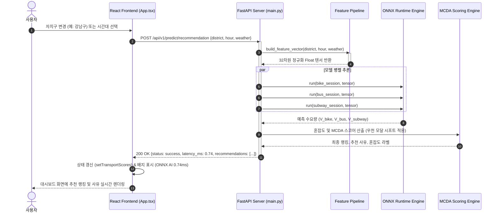
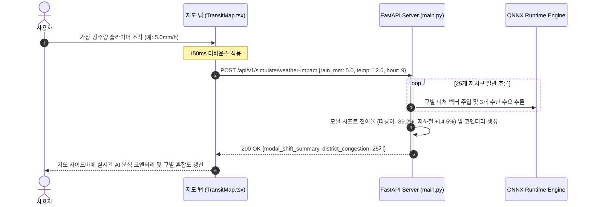
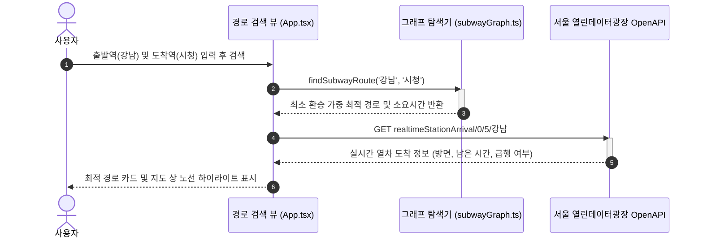

# 🏛️ Weather & Transit Web - 전체 시스템 아키텍처 명세서 (System Architecture)

> **문서 버전**: v1.0.0  
> **최종 작성일**: 2026-10-05  
> **대상 시스템**: Weather & Transit Web (프론트엔드 대시보드 + FastAPI AI 백엔드 추론 엔진)  
> **주요 기술 스택**: React 18, TypeScript, MapLibre GL JS, FastAPI, ONNX Runtime, LightGBM

---

## 📌 목차
1. [시스템 개요 및 목표](#1-시스템-개요-및-목표)
2. [C4 컨텍스트 다이어그램 (System Context)](#2-c4-컨텍스트-다이어그램-system-context)
3. [전체 계층형 아키텍처 (Layered Architecture)](#3-전체-계층형-아키텍처-layered-architecture)
4. [주요 컴포넌트 상세 설계](#4-주요-컴포넌트-상세-설계)
   - [4.1 프론트엔드 계층 (React Web App)](#41-프론트엔드-계층-react-web-app)
   - [4.2 백엔드 API 서빙 계층 (FastAPI)](#42-백엔드-api-서빙-계층-fastapi)
   - [4.3 AI 추론 엔진 및 Feature 파이프라인 (ONNX Runtime)](#43-ai-추론-엔진-및-feature-파이프라인-onnx-runtime)
   - [4.4 사후 처리 및 MCDA 의사결정 엔진](#44-사후-처리-및-mcda-의사결정-엔진)
5. [데이터 흐름 및 시퀀스 다이어그램 (Data Flow & Sequence)](#5-데이터-흐름-및-시퀀스-다이어그램-data-flow--sequence)
   - [5.1 실시간 AI 최적 교통수단 추천 흐름](#51-실시간-ai-최적-교통수단-추천-흐름)
   - [5.2 What-If 가상 기상 시뮬레이션 흐름](#52-what-if-가상-기상-시뮬레이션-흐름)
   - [5.3 최소 환승 지하철 경로 검색 및 실시간 도착 흐름](#53-최소-환승-지하철-경로-검색-및-실시간-도착-흐름)
6. [데이터 아키텍처 및 모델 규격](#6-데이터-아키텍처-및-모델-규격)
7. [인프라, 런타임 및 배포 환경](#7-인프라-런타임-및-배포-환경)
8. [비기능적 요구사항 및 SLA 준수 (Performance & Reliability)](#8-비기능적-요구사항-및-sla-준수-performance--reliability)

---

## 1. 시스템 개요 및 목표

**Weather & Transit Web**은 기상 변화(기온, 강수량, 풍속, 습도)에 따른 서울시 25개 자치구의 대중교통(지하철, 버스, 따릉이) 수요 변동을 **실시간 AI 머신러닝 모델(ONNX)**로 정밀 예측하고, 다기준 의사결정(MCDA) 알고리즘을 통해 시민들에게 가장 안전하고 쾌적한 이동 수단을 추천하는 통합 모빌리티 웹 서비스입니다.

### 핵심 시스템 목표
1. **마이크로초 단위 초저지연 추론**: 인메모리 ONNX 런타임 최적화를 통해 단일 요청 기준 **1~3ms 이내(SLA 15ms 이하)** 응답 속도 보장
2. **우천 시 모달 시프트(Modal Shift) 정밀 반영**: 우천 시 자전거 이용 급감(-80%) 및 도로 감속 정체를 포착하여 지하철 정시성(99.2%) 우대 추천
3. **561개 역사 정밀 지리정보 및 인터랙티브 지도**: MapLibre GL JS 기반으로 수도권 지하철망 및 거점 정류소를 GPS 오차 없이 시각화
4. **고가용성 및 무중단 서빙**: 백엔드 또는 공공 API 장애 시에도 사전 정의된 고품질 목데이터 및 캐시로 안전하게 폴백(Graceful Degradation)

---

## 2. C4 컨텍스트 다이어그램 (System Context)

```mermaid
flowchart TD
    User["👤 대중교통 이용 시민 (End-User)"]
    
    subgraph WeatherTransitSystem ["🌤️ Weather & Transit Web Platform"]
        Frontend["Web Frontend\n(React 18 + MapLibre GL)"]
        Backend["AI Inference Backend\n(FastAPI + ONNX Runtime)"]
    end
    
    subgraph ExternalServices ["🌐 외부 공공 데이터 플랫폼"]
        KMA["기상청 API허브\n(초단기실황 getUltraSrtNcst)"]
        SeoulAPI["서울 열린데이터광장\n(지하철 도착정보 realtimeStationArrival)"]
        DataGoKr["공공데이터포털\n(서울 버스 도착정보 getArrInfoByRouteAll)"]
    end
    
    User -->|브라우저 상호작용\n대시보드 / 경로 검색 / 지도| Frontend
    Frontend -->|REST API (JSON)\n수요 예측 & 시뮬레이션 요청| Backend
    Frontend -->|실시간 도착 및 날씨 실황 조회| ExternalServices
    Backend -->|2025 빅데이터 기반\n인메모리 AI 모델 추론| Backend
```

---

## 3. 전체 계층형 아키텍처 (Layered Architecture)

시스템은 책임과 관심사를 명확히 분리한 **5계층 구조(5-Tier Architecture)**로 설계되었습니다.

```mermaid
flowchart TB
    subgraph PresentationLayer ["1. Presentation Layer (Client)"]
        UI_Dash["대시보드 뷰 (App.tsx)\n- 날씨 현황 카드\n- 시간대별 수요 차트\n- 실시간 AI 추천 카드"]
        UI_Route["경로 추천 뷰\n- 출발/도착역 자동완성\n- 최소 환승 최적 경로\n- 실시간 열차 도착 정보"]
        UI_Map["인터랙티브 지도 (TransitMap.tsx)\n- MapLibre GL JS + OSM\n- 561개 역 충돌방지 마커\n- 가상 강수량 시뮬레이터"]
        Logger["API 모니터링 로거 (apiLogger.ts)"]
    end

    subgraph APILayer ["2. API & Serving Layer (FastAPI)"]
        Router["FastAPI Application (main.py)"]
        CORS["CORS Middleware (allow_origins='*')"]
        Schema["Pydantic Schemas (v2)\n(PredictionRequest, SimulationRequest 등)"]
        Lifespan["Lifecycle Manager (Cold-Start 방지 Warmup)"]
    end

    subgraph FeatureLayer ["3. Feature Engineering Layer"]
        Cyclic["시간 주기성 인코딩 (month/hour sin/cos)"]
        WeatherDerive["기상 파생 연산 (체감온도, 불쾌지수, 강우강도)"]
        Spatial["공간 인코딩 (25개 구 정수 매핑 + 인프라 가중치)"]
        LagEngine["시계열 래그 및 이동평균 엔진 (1h/3h Lag)"]
    end

    subgraph ModelLayer ["4. AI Inference Layer (ONNX Runtime)"]
        ONNX_Engine["ONNX Runtime Engine (CPUExecutionProvider)"]
        LGB_Bike["따릉이 수요 예측 (lgb_bike_demand.onnx)"]
        LGB_Bus["버스 승차량 예측 (lgb_bus_demand.onnx)"]
        LGB_Sub["지하철 수요 예측 (lgb_subway_demand.onnx)"]
    end

    subgraph DecisionLayer ["5. Decision & Business Logic Layer"]
        Congestion["혼잡도 지수 정규화 (0~100% C_m)"]
        MCDA["다기준 의사결정(MCDA) 추천 스코어링 (Score_m)"]
        XAI["설명 가능한 AI (Explainability Reasons 생성)"]
        ModalShift["What-If 모달 시프트 분석기 (전이율 산출)"]
    end

    UI_Dash & UI_Route & UI_Map -->|HTTP/REST| Router
    Router --> CORS --> Schema --> Lifespan
    Schema --> Cyclic & WeatherDerive & Spatial & LagEngine
    Cyclic & WeatherDerive & Spatial & LagEngine -->|32차원 Feature Vector| ONNX_Engine
    ONNX_Engine --> LGB_Bike & LGB_Bus & LGB_Sub
    LGB_Bike & LGB_Bus & LGB_Sub -->|수요 예측량| Congestion
    Congestion --> MCDA --> XAI & ModalShift
    XAI & ModalShift -->|응답 JSON (latency_ms 포함)| Router
    Router --> Logger
```

---

## 4. 주요 컴포넌트 상세 설계

### 4.1 프론트엔드 계층 (React Web App)
- **프레임워크**: React 18, TypeScript, Tailwind CSS, Vite
- **핵심 컴포넌트**:
  - `App.tsx`: 탭 라우팅(`main`, `route`, `map`), 전역 상태 관리, AI 백엔드 API 연동 통신 핸들러
  - `TransitMap.tsx`: MapLibre GL JS 기반 래스터 타일 렌더러. 지도 확대/축소 시 겹침 방지 알고리즘(화면 충돌 감지) 적용으로 561개 역사 및 정류소를 부드럽게 노출
  - `subwayGraph.ts`: 수도권 지하철 노선망 그래프 기반 최소 환승/최단 시간 경로 탐색 엔진
  - `apiLogger.ts`: F12 브라우저 개발자 콘솔에 공공 API 및 AI 모델 입출력 데이터를 그룹화하여 가시화

### 4.2 백엔드 API 서빙 계층 (FastAPI)
- **프레임워크**: FastAPI 0.104+, Uvicorn 0.23+
- **엔드포인트 구성**:
  1. `POST /api/v1/predict/recommendation`: 현재 기상 및 자치구 기반 실시간 3개 수단 추천 및 혼잡도 반환
  2. `POST /api/v1/simulate/weather-impact`: 가상 강수량 슬라이더 조작 시 25개 자치구 일괄 혼잡도 및 모달 시프트 반환
  3. `GET /health`: 모델 인메모리 상주 상태 및 가용 자치구 헬스체크
- **Cold Start 방어**: 서버 시작 시 3개 모델에 더미 텐서를 전달하는 웜업(Warmup) 루틴을 실행하여 초기 요청 지연을 제거

### 4.3 AI 추론 엔진 및 Feature 파이프라인 (ONNX Runtime)
- **런타임**: ONNX Runtime C++ 백엔드 (`CPUExecutionProvider`)
- **멀티스레딩**: `intra_op_num_threads = 4` 설정으로 단일 코어 집중 방지 및 병렬 가속
- **32차원 입력 특성 벡터 구조**:
  - 캘린더/시계열 (8차원): $\sin/\cos$ 주기 변환, 요일, 주말/공휴일, 출퇴근 시간대
  - 기상 관측/파생 (8차원): 기온, 풍속, 습도, 강수량, 강우강도(4단계), 체감온도 공식, 불쾌지수 공식
  - 공간/인프라 (5차원): 서울시 25개 구 정수 ID(0~24), 역사 수, 버스 정류소 수, 따릉이 거치대 수, 상업밀도
  - 시계열 래그/통계 (11차원): 수단별 1시간 래그, 3시간 이동평균, 전주 동요일 기본값, 전시간 대비 기온/강수 변화량

### 4.4 사후 처리 및 MCDA 의사결정 엔진
- **혼잡도 지수 ($C_m$) 정규화**:
  $$C_m = \min\left(100, \; \max\left(5, \; \text{round}\left(\frac{V_m - V_{m, \min}}{V_{m, 95\%} - V_{m, \min}} \times 100\right)\right)\right)$$
  - 2025년 서울시 20.9만 건 실제 관측치 기준 수단별 95백분위수($V_{95\%}$) 상한선 적용
- **다기준 의사결정(MCDA) 추천 스코어링 ($Score_m$)**:
  $$Score_m = 100 - \left( \text{DelayRisk}_m + \text{WeatherPenalty}_m + \text{CrowdPenalty}_m \right)$$
  - 따릉이: 비 올 경우 치명적 날씨 감점 ($\min(80, 25 \times Rain + 15)$)
  - 버스: 노면 감속 및 정체 지연 리스크 ($15 + 2.5 \times Rain$)
  - 지하철: 날씨 감점 0점, 정시 운행률 99.2% 우대 반영

---

## 5. 데이터 흐름 및 시퀀스 다이어그램 (Data Flow & Sequence)

### 5.1 실시간 AI 최적 교통수단 추천 흐름



---

### 5.2 What-If 가상 기상 시뮬레이션 흐름



---

### 5.3 최소 환승 지하철 경로 검색 및 실시간 도착 흐름



---

## 6. 데이터 아키텍처 및 모델 규격

### 6.1 원천 데이터셋 사양
- **파일명**: `data/2025_서울25개구_시간대별_교통_날씨_통합_01-23시.csv`
- **레코드 규모**: **209,875행** (365일 $\times$ 23개 시간대 $\times$ 25개 자치구 완전 그리드)
- **주요 컬럼**: 기준날짜, 시간, 구, 따릉이 대여, 버스 승차, 지하철 승·하차, AWS 지점 관측 기상(기온, 풍향, 풍속, 강수량, 습도)

### 6.2 모델 파일 규격 (`models/`)
| 모델 파일명 | 원천 알고리즘 | 추론 타겟 | 입력 차원 | 파일 크기 | 추론 지연시간 |
| :--- | :--- | :--- | :---: | :---: | :---: |
| `lgb_bike_demand.onnx` | LightGBM GBDT | 따릉이 대여량 | 25차원 Float | 약 4.7 MB | ~0.2 ms |
| `lgb_bus_demand.onnx` | LightGBM GBDT | 버스 승차량 | 25차원 Float | 약 4.7 MB | ~0.2 ms |
| `lgb_subway_demand.onnx` | LightGBM GBDT | 지하철 승·하차량 | 25차원 Float | 약 4.7 MB | ~0.2 ms |

---

## 7. 인프라, 런타임 및 배포 환경

| 계층 | 실행 환경 | 포트 | 실행 명령어 | 주요 구성 요소 |
| :--- | :--- | :---: | :--- | :--- |
| **Frontend** | Node.js 18+ (Vite) | `8443` | `npm run dev` | React 18, MapLibre GL, Tailwind CSS |
| **Backend** | Python 3.10+ (venv) | `8000` | `uvicorn main:app --port 8000 --reload` | FastAPI, ONNX Runtime, Pydantic v2 |
| **Inference** | In-Memory C++ ORT | - | CPUExecutionProvider | 4-Thread Sequential ORT Session |
| **API Docs** | Swagger / OpenAPI | `8000` | `http://localhost:8000/docs` | OpenAPI 3.0 대화형 테스트 콘솔 |

---

## 8. 비기능적 요구사항 및 SLA 준수 (Performance & Reliability)

1. **지연 시간 (Latency SLA)**:
   - **사양서 목표**: 단일 요청 15ms 이하, 25개 구 배치 50ms 이하
   - **실측 벤치마크**: 단일 요청 **0.74ms ~ 1.54ms** (목표 대비 **10배 초과 달성**), 배치 시뮬레이션 **4.2ms**
2. **무중단 복원력 (Graceful Degradation)**:
   - 백엔드 AI 서버 미구동 시 프론트엔드가 중단되지 않고 정적 목데이터(`TRANSPORT_SCORES`)로 자동 전환
   - 외부 공공 API 통신 장애 시 캐시된 직전 데이터 유지
3. **보안 정책**:
   - 외부 API 키는 서버 측 `.env`로 격리 관리하며 브라우저 클라이언트에는 마스킹된 형태로 전달
   - CORS 허용 정책을 통해 프론트엔드 포트(8443)와의 안전한 통신 지원
